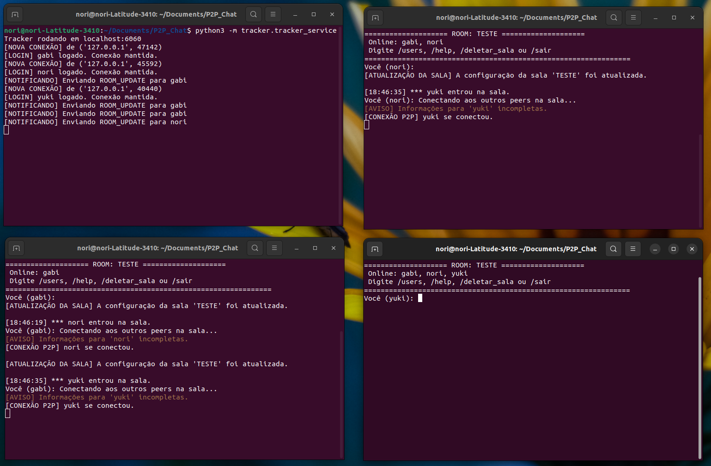

---
pdf_options:
  format: A4
  margin: 100px 40px
  printBackground: true
  displayHeaderFooter: true
  headerTemplate: |
    <div style="width: 100%; padding-right: 40px; box-sizing: border-box; font-family: sans-serif; font-size: 10px; text-align: right;">
    </div>
  footerTemplate: |
    <style>
      section {
        font-family: sans-serif;
        font-size: 10px;
        width: 100%;
        text-align: center;
      }
    </style>
    <section>
      Página <span class="pageNumber"></span> de <span class="totalPages"></span>
    </section>
highlightTheme: monokai
---

**Universidade de Brasília (UnB)**  
Departamento de Ciência da Computação  
Disciplina: Redes de Computadores <br>
**Alunos:** Marcos Noriyuki Miyata – 18/0126890 e Valeria Alexandra Guevara Parra – 24/2039775  
**Professor:** JACIR LUIZ BORDIM  
**Semestre:** 1º/2025

<div align="center">
<h1>Trabalho Prático: Implementação de um Chat P2P</h1>
</div>

[**Link do repositório no github**](https://github.com/nori-marcos/P2P_Chat.git)

**Índice**

- [1. Tracker](#1-tracker)
  - [1.1. UserRepository](#11-userrepository)
  - [1.2. RoomRepository](#12-roomrepository)
  - [1.3. PeerRepository](#13-peerrepository)
  - [1.4. UserCommandHandler](#14-usercommandhandler)
  - [1.5. RoomCommandHandler](#15-roomcommandhandler)
  - [1.6. PeerCommandHandler](#16-peercommandhandler)
- [2. Peer](#2-peer)
  - [2.1. PeerPeerCommunication](#21-peerpeercommunication)
  - [2.2. PeerService](#22-peerservice)
  - [2.3. PeerTrackerCommunication](#23-peertrackercommunication)
- [3. Commons](#3-commons)
  - [3.1. Peer](#31-peer)
  - [3.2. Room](#32-room)
  - [3.3. User](#33-user)
- [4. Captura de tela](#4-captura-de-tela)
  - [4.1. Registro de usuário](#41-registro-de-usuário)
  - [4.2. Autenticação de usuário](#42-autenticação-de-usuário)
  - [4.3. Registro de informação no arquivo JSON](#43-registro-de-informação-no-arquivo-json)
  - [4.4. Peer se conectando ao tracker](#44-peer-se-conectando-ao-tracker)
  - [4.5. Criação de sala](#45-criação-de-sala)
  - [4.6. Sala com três participantes](#46-sala-com-três-participantes)
  - [4.7. Três peers conectados](#47-três-peers-conectados)
  - [4.8. Três peers conversando na sala](#48-três-peers-conversando-na-sala)


# P2P Chat

## 1. Tracker

O tracker é um servidor que mantém uma lista de peers conectados e suas respectivas portas. Ele permite que os peers se
registrem e obtenham informações sobre outros peers disponíveis na rede.

Para iniciar uma instância do tracker, são necessários os parâmetros de host, porta e o caminho para o banco de dados de
usuários. O users_db é um arquivo JSON que armazena o nome e a senha criptografada dos usuários registrados.

```python
class TrackerServer:
	def __init__(self, host='localhost', port=6060, users_db='users_db.json'):
		self.host = host
		self.port = port
		self.users_db = users_db
		self.users = self.load_users()
		self.peers = {}
		self.login_history = {}
		self.last_ping = {}
		self.rooms = {}
```

Os atributos principais do tracker incluem:

- `host`: Endereço IP do tracker.
- `port`: Porta na qual o tracker escuta conexões.
- `users_db`: Caminho para o arquivo JSON que armazena os usuários registrados.
- `users`: Dicionário que carrega os usuários do banco de dados.
- `peers`: Dicionário que mapeia os peers conectados e seus respectivos endereços IP e portas.
- `login_history`: Dicionário que registra o histórico de login dos usuários.
- `last_ping`: Dicionário que armazena o último ping recebido de cada peer para saber se estão ativos.
- `rooms`: Dicionário que mapeia salas de chat e seus respectivos participantes.

Em relação aos principais métodos:

- `load_users()`: Carrega os usuários do banco de dados salvo no arquivo `users_db.json`.
- `save_users()`: Salva os usuários no banco de dados no arquivo `users_db.json`.
- `handle_login()`: Autentica um usuário recebendo nome e senha, e registra seu peer. Depois da autenticação, o peer é
  adicionado à lista de peers conectados.
- `handle_register()`: Registra um novo usuário com nome e senha, verifica se o nome de usuário já existe.
- `handle_list_peers()`: Retorna a lista de peers conectados, mostrando o nome, o seu último login e seus status online
  ou offline de acordo com o seu último ping (se foi recebido nos últimos 30 segundos).
- `handle_ping()`: Atualiza o timestamp do último ping de um peer.
- `handle_create_room()`: Cria uma nova sala de chat, verifica se o nome da sala já existe e adiciona o peer
  como participante.
- `handle_list_rooms()`: Retorna a lista de salas de chat disponíveis, mostrando o nome da sala e os participantes.
- `handle_join_room()`: Adiciona um peer a uma sala de chat existente.
- `handle_client()`: Método principal que lida com as requisições dos peers: LOGIN, REGISTER, LIST_PEERS, PING,
  CREATE_ROOM, LIST_ROOMS, JOIN_ROOM. Ele recebe as requisições dos peers e chama o método apropriado para tratá-las.
- `start()`: Inicia o servidor tracker, escutando conexões na porta especificada e aguardando requisições dos peers.

### 1.1. UserRepository
Classe responsável por gerenciar os dados de usuários registrados no sistema P2P. Atua como persistência simples via arquivo JSON local (users_db.json).

Principais Atributos:
-`path`: caminho para o arquivo de banco de dados dos usuários (por padrão, users_db.json na mesma pasta do script).
-`users`: dicionário de usuários carregado do arquivo, com o formato {username: User}.

Principais Métodos:
-`load_users()`:Carrega os usuários do arquivo JSON. Se o arquivo estiver vazio ou corrompido, recria um novo banco vazio.
-`save_users()`:Salva os dados atuais dos usuários no arquivo JSON, armazenando apenas os nomes de usuário e senhas.
-`create_user(username, password)`:Cria um novo usuário, se o nome ainda não estiver em uso. Retorna True em caso de sucesso ou False se já existir.
-`validate_user(username, password)`:Verifica se um usuário existe e se a senha fornecida é correta.
-`user_exists(username)`:Retorna True se o usuário já estiver registrado, caso contrário False.
-`get_user(username)`:Retorna o objeto User correspondente ao username, ou None se não existir.

### 1.2. RoomRepository
Classe responsável por gerenciar as salas de bate-papo (rooms) do sistema P2P, realizando persistência local no arquivo rooms_db.json.

Principais Atributos:
-`path`: caminho do arquivo JSON onde os dados das salas são armazenados.
-`rooms`: dicionário que mapeia nomes de salas para objetos Room.

Principais Métodos:
-`load_rooms()`:Carrega todas as salas a partir do arquivo JSON. Se estiver vazio ou corrompido, recria um arquivo novo.
-`_save_empty_rooms()`:Cria e salva um dicionário de salas vazio no arquivo JSON.
-`save_rooms()`:Serializa e salva o dicionário atual de salas (self.rooms) no arquivo.
-`create_room(room_name, peer_owner)`:Cria uma nova sala com o peer_owner como proprietário. Retorna True em caso de sucesso ou False se a sala já existir.
-`join_room(room_name, peer)`:Adiciona um peer a uma sala existente como peer_one ou peer_two, se houver espaço disponível. Retorna True em caso de sucesso.
-`leave_room(room_name, peer)`:Remove o peer da sala, se ele estiver presente. Proprietários não são removidos automaticamente aqui.
-`list_rooms()`:Retorna a lista com os nomes de todas as salas registradas.
-`get_room_of_peer(username)`:Retorna o nome da sala onde o username está presente, ou None se ele não estiver em nenhuma.
-`get_room(room_name)`:Retorna o objeto Room correspondente ao nome informado.
-`delete_room(room_name, username)`:Remove a sala caso o username seja o proprietário da mesma. Retorna True se a remoção foi bem-sucedida.


### 1.3. PeerRepository
Classe responsável por gerenciar os Peers registrados no sistema P2P, mantendo o estado de conexão e persistência local no arquivo peers_db.json.

Principais Atributos:
-`path`: caminho do arquivo onde os peers são salvos em JSON.
-`peers`: dicionário que associa nomes de usuários a objetos Peer.

Principais Métodos:
-`load_peers()`:Carrega os peers do arquivo JSON. Se não existir ou estiver corrompido, recria um arquivo vazio.
-`save_peers()`:Salva o dicionário atual de peers em formato JSON no arquivo.
-`add_peer(peer)`:Adiciona um novo Peer ao repositório, sobrescrevendo se já existir, e persiste a mudança.
-`remove_peer(username)`:Remove um peer pelo username e salva a alteração.
-`get_peer(username)`:Retorna o objeto Peer correspondente ao nome, ou None se não existir.
-`get_all_peers()`:Retorna uma lista com todos os peers cadastrados.
-`is_connected(username)`:Retorna True se o peer está conectado (connected == True), senão False.
-`update_connection(username, address, port)`:Atualiza o endereço, porta e status de conexão de um peer. Cria um novo Peer se ele ainda não existir.

### 1.4. UserCommandHandler
Responsável por processar ações de autenticação e registro de usuários. Usa os repositórios de usuários (UserRepository) e peers (PeerRepository).

Principais Métodos:
-`login(data)`:Autentica o usuário a partir de username e password. Se válido, atualiza o peer com IP e porta.
-`register(data)`:Registra um novo usuário se ele ainda não existir e atualiza os dados de conexão no PeerRepository.

###  1.5. RoomCommandHandler
Gerencia as operações de salas de bate-papo. Interage com os repositórios de salas (RoomRepository) e peers (PeerRepository), além de manter notificações por conexão ativa.

Principais Métodos:
-`create_room(conn, data)`:Cria uma sala com um peer como proprietário, se ela ainda não existir.
-`join_room(conn, data)`:Permite que um peer entre em uma sala existente. Notifica os demais participantes.
-`leave_room(conn, data)`:Remove o peer da sala e atualiza os demais participantes, se necessário.
-`list_rooms(conn, data)`:Retorna todas as salas disponíveis e seus dados.
-`delete_room(conn, data)`:Exclui a sala se o peer solicitante for o proprietário.
-`_notify_participants(...)`:Função interna usada para notificar os participantes de uma sala quando ela é atualizada.

###  1.6. PeerCommandHandler
Responsável por fornecer informações sobre peers conectados.

Principais Métodos:
-`list_peers(conn, data)`:Lista todos os peers atualmente conectados e disponíveis para comunicação, incluindo a sala em que estão (se aplicável).

## 2. Peer

O Peer representa um cliente na rede P2P que pode se comunicar com outros peers diretamente e também com o servidor Tracker. Ele realiza ações como autenticação, envio/recebimento de mensagens, participação em salas de bate-papo, e chats privados.

### 2.1. PeerPeerCommunication
Classe que gerencia conexões P2P com outros peers para envio e recebimento de mensagens.

Atributos principais:
- `host`: endereço local no qual o peer escuta conexões (por padrão, localhost).
- `port`: porta onde escutará as conexões (se 0, o sistema escolhe).
- `socket`: socket TCP que escuta as conexões.
- `connections`: dicionário com peers conectados mapeados por nome de usuário.
- `on_message_received`: callback que trata mensagens recebidas.

Métodos principais:
- `listen_for_peers()`: inicia a escuta por conexões P2P, aceitando peers que se conectam.
- `peer_connection(conn)`: trata a conexão recebida de outro peer, verifica comandos como HELLO e PING.
- `connect_to_peer(peer_info, from_username)`: conecta-se a outro peer utilizando IP e porta fornecidos, enviando mensagem HELLO.
- `receive_messages(conn, username)`: escuta mensagens recebidas de um peer, tratando comandos como MESSAGE e LEAVE.
- `send_message(room_name, to_username, from_username, content)`: envia uma mensagem a outro peer.
- `leave_room(peers_in_room)`: envia um aviso de saída (LEAVE) a todos os peers de uma sala.
- `disconnect_from_peer(username)`: encerra conexão com um peer específico.
- `cleanup_connection(conn, username)`: remove conexões limpas do dicionário.
- `close()`: encerra todas as conexões e o socket de escuta.

### 2.2. PeerService

Classe que representa o ciclo de vida do peer, interface com o usuário e a lógica principal da aplicação.

Atributos principais:
- `peer_comm`: instância de PeerPeerCommunication.
- `tracker_comm`: instância de PeerTrackerCommunication.
- `current_room`: sala de chat atual em que o peer está.
- `private_chat_with`: usuário com quem o peer está em chat privado.
- `username`: nome do usuário autenticado.
- `peer_colors`: dicionário para colorir mensagens por usuário.

Métodos principais:
- `start()`: inicia o peer, escutando conexões P2P e iniciando processo de autenticação.
- `handle_user_authentication()`: oferece opções de login, registro e saída.
- `handle_user_input()`: menu principal com opções de listar peers, criar/joinar salas, chat privado ou sair.
- `handle_user_message_in_room()`: trata o envio de mensagens em uma sala de chat, com comandos como /users, /sair, /deletar_sala.
- `handle_private_chat(peer_username)`: inicia e gerencia um chat privado com outro peer.
- `handle_p2p_message(command, sender_username, message_data)`: callback chamado quando uma mensagem P2P é recebida.
- `update_current_room(room_data)`: atualiza os dados da sala atual com novos participantes ou remoções.
- `connect_to_room_peers(peers_info_list)`: conecta-se aos peers de uma sala ao entrar nela.
- `safe_print(message, is_notification=False)`: imprime mensagens com segurança em ambiente com múltiplas threads.
- `clear_screen()`: limpa a tela do terminal.

### 2.3. PeerTrackerCommunication

Classe que gerencia a comunicação entre o peer e o servidor tracker. Toda comunicação com o tracker (login, registro, criar/joinar sala, etc.) passa por aqui.

Atributos principais:
- `peer_host`: IP local do peer.
- `peer_port`: porta na qual o peer está escutando.
- `peer_service`: instância do PeerService que permite comunicação inversa com o peer.
- `socket`: socket TCP conectado ao tracker.
- `response_queue`: fila para armazenar respostas do tracker.
- `listener_thread`: thread que escuta mensagens do tracker em tempo real.

Métodos principais:
- `connect()`: conecta ao servidor tracker e inicia a escuta assíncrona.
- `listen_for_tracker_messages()`: escuta mensagens do tracker, como atualizações de sala (ROOM_UPDATE).
- `send_request(message)`: envia uma requisição ao tracker e aguarda resposta.
- `close()`: encerra conexão e thread com o tracker.
- `login(username, password)`: realiza login do peer, enviando nome, senha (hash) e porta para conexão.
- `register(username, password)`: registra um novo usuário no tracker.
- `list_peers()`: solicita lista de peers conectados ao tracker.
- `list_rooms()`: solicita lista de salas criadas.
- `create_room(username, room_name)`: cria uma nova sala de chat.
- `join_room(username, room_name)`: entra em uma sala existente.
- `leave_room(username, room_name)`: sai de uma sala de chat.
- `delete_room(username, room_name)`: remove uma sala (apenas se o peer for o dono).

## 3. Commons

### 3.1. Peer

A classe Peer representa um participante conectado na rede P2P, com suas informações essenciais para comunicação e status.

Atributos principais:
- `username`: nome de usuário do peer.
- `last_ping`: dicionário com timestamps dos últimos ping, indicando quando o peer esteve ativo.
- `address`: endereço IP do peer.
- `port`: porta utilizada pelo peer (embora inicializado com None por padrão).
- `connected`: booleano que indica se o peer está online.

Métodos principais:
- `to_dict()`: converte o peer em dicionário com campos username, last_ping, address, port e connected, permitindo envio via JSON.
- `@staticmethod from_dict(data)`: cria uma instância de Peer a partir de um dicionário com as mesmas chaves.

### 3.2. Room

A classe Room modela uma sala de chat entre até três peers, incluindo seu dono e convidados.

Atributos principais:
- `name`: nome da sala.
- `peer_owner`: objeto Peer que criou a sala.
- `peer_one, peer_two`: objetos Peer participantes subsequentes.

Métodos principais:
- `to_dict()`: converte a sala para um dicionário, incluindo somente peers com conexão ativa (connected=True), endereço e porta definidos; peers inválidos são omitidos com None.
- `_safe_peer_to_dict(peer)`: método auxiliar para checar se um peer pode ser representado; retorna peer.to_dict() ou None.
- `@staticmethod from_dict(data)`: reconstrói a instância Room a partir de dados do tracker.
- `get_participants_usernames()`: retorna uma lista com os nomes de usuário dos peers presentes (owner, peer_one e peer_two, se existirem).
- `list_participants()`: retorna lista de objetos Peer presentes na sala.

### 3.3. User

A classe User representa o usuário no sistema de autenticação e registro (no tracker).

Atributos principais:
- `username`: nome de usuário.
- `password`: senha armazenada (geralmente já criptografada).

Métodos principais:
- `to_dict()`: retorna apenas a senha (espera-se que seja um valor criptografado) — usado ao salvar no JSON de usuários.
- `@staticmethod from_dict(username, password)`: instância um User a partir das credenciais.

## 4. Captura de tela
### 4.1. Registro de usuário
Caso em que usuário já existe:


Comunicação entre o tracker e o peer:


Logs do tracker e do peer:


Caso de sucesso:


### 4.2. Autenticação de usuário
Teste de autenticação com válido e inválido:


### 4.3. Registro de informação no arquivo JSON


### 4.4. Peer se conectando ao tracker


### 4.5. Criação de sala


### 4.6. Sala com três participantes


### 4.7. Três peers conectados


### 4.8. Três peers conversando na sala
